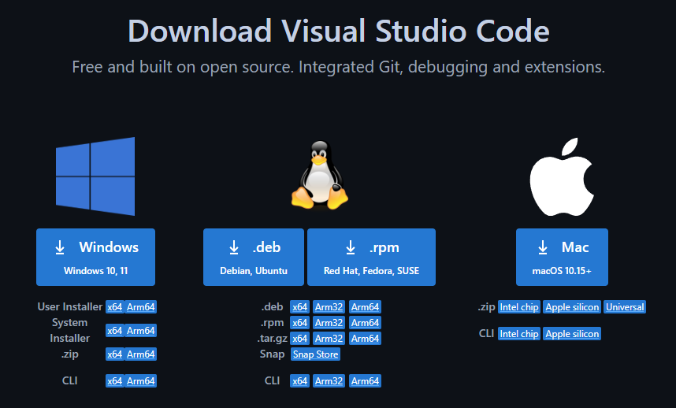
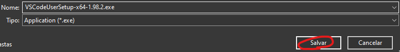

# 1 Introduccion
En este apartado instalaremos y configuraremos todos los programas que vamos a necesitar para el curso.

## Visual Studio Code
Primero necesitaremos un editor de codigo, para esto, Visual Studio Code es una recomendacion bastante facil dada su versatibilidad, estilo, y el hecho de que es completamente gratis.

Tened en cuenta de que podeis usar cualquier IDE (entorno de desarrollo integrado) que no sea este, en caso de que querais probar otros, recomiendo ver Atom.

### Instalacion de Visual Studio Code
Para poder instalar Visual Studio Code, tendremos que ir a su pagina de descargas.
#### Descarga
https://code.visualstudio.com/Download

Aqui tenemos que elegir la version correcta

Despues de esto, una vez le hagamos click a la version que nos corresponde, tendremos que guardarlo

